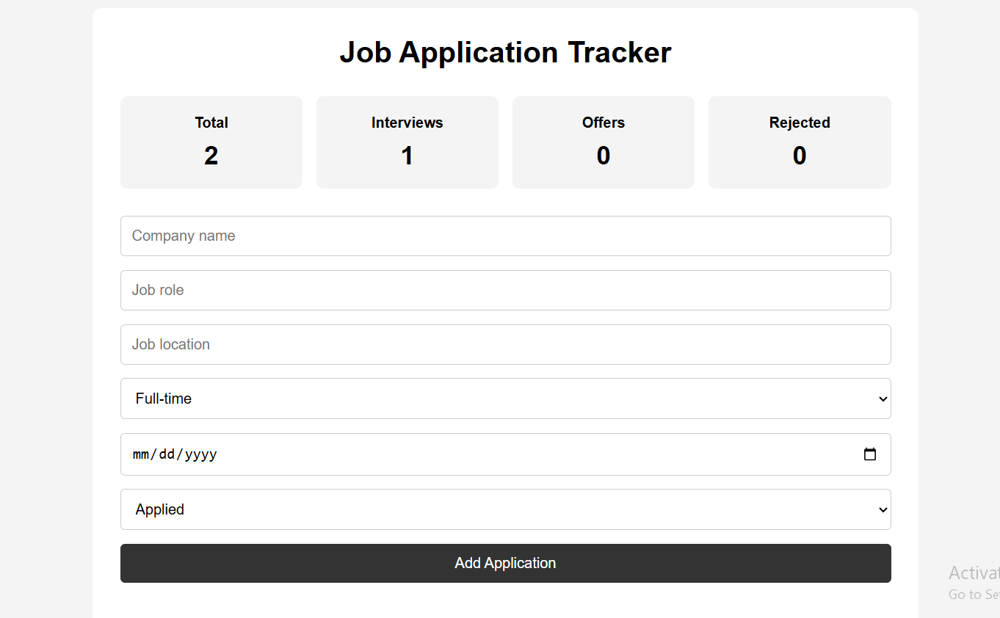
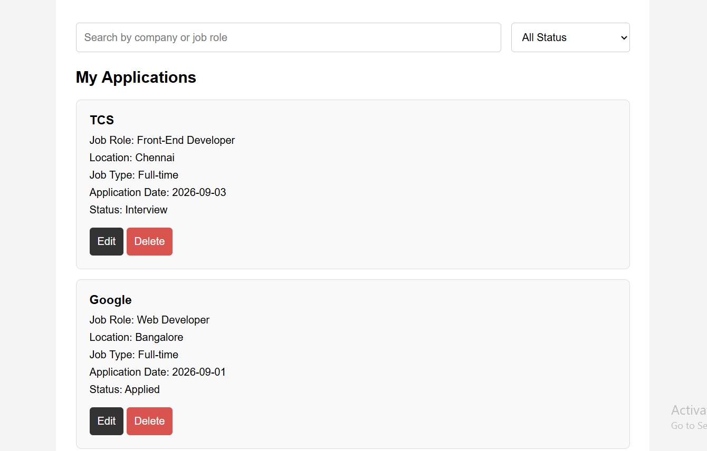

# 💼 Job Application Tracker

A responsive web application built with **HTML, CSS, and JavaScript** to help users organize and track their job applications efficiently.

🌐 Live Demo

🔗 [View Live Demo](https://subalakshmi4.github.io/job-application-tracker/)

## 🖼️ Project Preview

### 📊 Dashboard


### 🔍 Search & Filter


## ✨ Features

* ➕ Add new job applications
* ✏️ Edit existing applications
* 🗑️ Delete applications
* 📊 Track application status
* 🔍 Search applications by company or job role
* 🔽 Filter applications by status
* 📈 View application statistics
* 💾 Store application data using LocalStorage
* 📱 Responsive design for different screen sizes
* ✅ Form validation

## 🛠️ Technologies Used

* 🌐 **HTML5**
* 🎨 **CSS3**
* ⚡ **JavaScript**
* 💾 **Browser LocalStorage**

## 🧠 JavaScript Concepts Used

* 📦 Variables and constants
* 🔧 Functions
* 📋 Arrays and objects
* 🔀 Conditional statements
* 🔄 Array methods
* 🌳 DOM manipulation
* 🖱️ Event handling
* 💾 LocalStorage
* 🔤 String methods

## ⚙️ How It Works

Users can enter:

* 🏢 Company name
* 💻 Job role
* 📍 Job location
* 💼 Job type
* 📅 Application date
* 📌 Application status

The application dynamically creates application cards and allows users to **edit or delete** their records.

Search and filter functionality helps users quickly find specific applications.

💾 Application data is stored in the browser using LocalStorage, so the information remains available even after refreshing the page.

## 📁 Project Structure

```text
job-application-tracker/
│
├── 📄 index.html
├── 🎨 style.css
├── ⚡ script.js
└── 📖 README.md
```

## 🚀 Future Improvements

* 🔐 Add user authentication
* ⏰ Add application deadlines and reminders
* 📤 Add data export functionality
* 📊 Add charts for application analytics
* ☁️ Add cloud-based data storage

## 🎯 Project Purpose

This project was developed to practice **HTML, CSS, and JavaScript fundamentals** while building a practical application for managing job applications.
